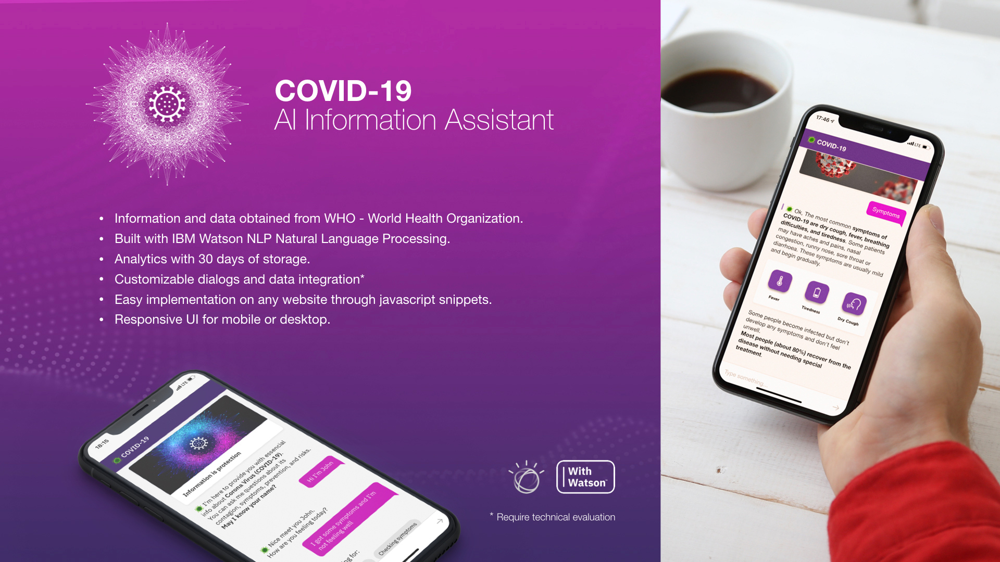

# COVID-19 AI Information Assistant
COVID-19 AI Information Assistant | IBM Watson

 
 
<strong>AI Assistant using IBM Watson technology taking WHO recommendations about COVID-19 in order to facilitate access to the information which is the first layer of people protection.</strong>  

The assistant is able to provide information about the virus, its symptoms, incubation period, risks, and global case statistics.
Using Watson Assistant Natural Language Processing, we're been able to provide a user-friendly approach utilizing multiple nodes of interactions prepared especially for this purpose.  

Through the Webhooks feature and IBM Serverless Cloud Functions, the assistant is capable to get connected with a data API that it's feeding with the latest statistics about the virus evolution across the world.  

<strong>This is a humble and small contribution for anyone who wants to use this tool as a baseline to spread reliable information in order to avoid contagion.</strong>

Test URL: http://disruptrstudio.com/AI/index.html

 
 

